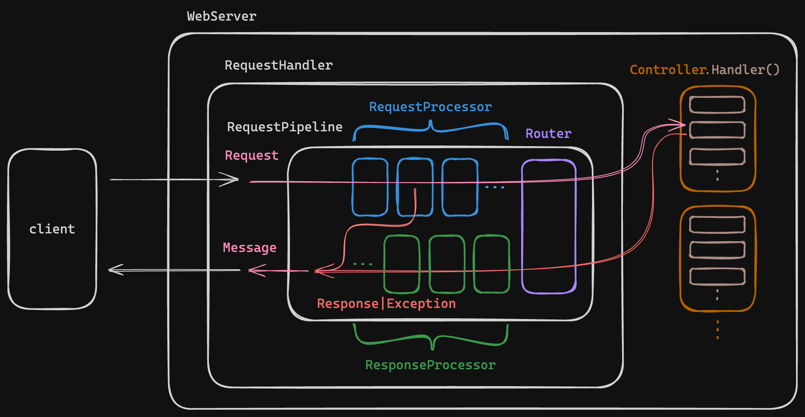

# 현대자동차 소프티어 부트캠프 3기 BE - WAS 과제

## 프로젝트 정보

소프티어 부트캠프 3기 BE 과제로 진행한 프로젝트입니다.  
과제 레포지토리: https://github.com/softeerbootcamp-3rd/be-was  
개인 레포지토리: https://github.com/thecloer/softeerbootcamp-3rd-be-was

이 프로젝트는 우아한 테크코스 박재성님의 허가를 받아 https://github.com/woowacourse/jwp-was
를 참고하여 작성되었습니다.

## WAS 구조



- [WebServer](https://github.com/thecloer/softeerbootcamp-3rd-be-was/blob/thecloer/src/main/java/webserver/WebServer.java):
  웹 서버의 시작점, 소켓을 생성하고 클라이언트의 요청을 받아 `RequestHandler`를 스레드에 할당
- [RequestHandler](https://github.com/thecloer/softeerbootcamp-3rd-be-was/blob/thecloer/src/main/java/webserver/RequestHandler.java):
  클라이언트의 요청으로 부터 `Request` 객체를 생성하고 최종 응답을 클라이언트에게 전송
- [RequestPipeline](https://github.com/thecloer/softeerbootcamp-3rd-be-was/blob/thecloer/src/main/java/webserver/RequesetPipline.java):
  요청으로부터 응답이 생성되기까지의 순서를 담당하는 파이프라인, 요청은 등록된 프로세서들(`RequestProcessor`, `ResponseProcessor`)을 거쳐 컨트롤러까지 도달
- [Router](https://github.com/thecloer/softeerbootcamp-3rd-be-was/blob/thecloer/src/main/java/webserver/Router.java):
  요청과 컨트롤러의 핸들러를 매핑
- [Controller](https://github.com/thecloer/softeerbootcamp-3rd-be-was/tree/thecloer/src/main/java/controller): 요청에 대한 메인
  로직을 실행하는 부분

## 프로젝트 진행 과정 기록

- [1단계 - index.html 응답](#1단계---indexhtml-응답)
- [2단계 - GET으로 회원가입](#2단계---get으로-회원가입)
- [3단계 - 다양한 컨텐츠 타입 지원](#3단계---다양한-컨텐츠-타입-지원)
- [4단계 - POST로 회원 가입](#4단계---post로-회원-가입)
- [5단계 - 쿠키를 이용한 로그인](#5단계---쿠키를-이용한-로그인)
- [6단계 - 동적인 HTML](#6단계---동적인-html)

<br/>

## 1단계 - index.html 응답

### 학습 키워드 & 학습 목표

> HTTP, java, HTTP GET, thread, concurrent

- HTTP를 학습하고 학습 지식을 기반으로 웹 서버를 구현한다.
- Java 멀티스레드 프로그래밍을 경험한다.
- 유지보수에 좋은 구조에 대해 고민하고 코드를 개선해 본다.

### 기능 요구사항

- ✅ http://localhost:8080/index.html 로 접속했을 때 `src/main/resources/templates` 디렉토리의 index.html 파일을 읽어 클라이언트에 응답한다.
- ✅ 서버로 들어오는 HTTP Request의 내용을 읽고 적절하게 파싱해서 로거(log.debug)를 이용해 출력한다.

### 프로그래밍 요구사항

- ✅ 프로젝트 분석
    - 단순히 요구사항 구현이 목표가 아니라 프로젝트의 동작 원리에 대해 파악한다.
- ✅ 구조 변경
    - 자바 스레드 모델에 대해 학습한다. 버전별로 어떤 변경점이 있었는지와 향후 지향점에 대해서도 학습해 본다.
    - 자바 Concurrent 패키지에 대해 학습한다.
    - 기존의 프로젝트는 Java Thread 기반으로 작성되어 있다. 이를 Concurrent 패키지를 사용하도록 변경한다.
- ✅ OOP와 클린코딩
    - 주어진 소스코드를 기반으로 기능요구사항을 만족하는 코드를 작성한다.
    - 유지보수에 좋은 구조에 대해 고민하고 코드를 개선해 본다.
    - 웹 리소스 파일은 제공된 파일을 수정해서 사용한다. (직접 작성해도 무방하다.)

### 구현 내용

- Http request 로깅
    - `[ {protocol} {method} ] {path?query#fragment}`


- 정적 파일 응답
    - 요청 리소스의 확장자에 따라 응답 헤더의 `Content-Type`설정, 리소스 경로 분기 응답
    - `.html` -> `resources/templates`
    - 이외 -> `resources/static`


- `Concurrent` 패키지가 제공하는 스레드 풀을 이용해 요청 처리
    - 기존 `Thread` 클래스로 요청마다 스레드를 생성, 제거 하며 요청을 처리하는 방식에서 요청을 큐에 넣고 스레드 풀에서 사용 가능한 스레드가 요청을 꺼내 처리하는 방식으로 변경

### 고민 사항

- #### 요청 url에서 확장자를 추출하는 메서드는 어떤 클래스에 구현해야할까?
    - `ContentType` enum에 private 메서드로 구현 vs 새로운 클래스 혹은 URI extends 한 클래스
    - 우선 아직은 사용되는 곳이 Content-Type 뿐이므로 ContentType enum에 private 메서드로 구현
    - 추후 필요시 유틸 클래스 혹은 URI 클래스를 상속받는 클래스를 만들어 빼낼 예정


- #### 오류 메세지 응답 혹은 오류 페이지 응답은 어떻게 할까?
    - step-2에서 라우터를 구현 한뒤 예외에 따라 오류 메세지 혹은 오류 페이지 응답 해보자

### 기타

- #### MIME(Multipurpose Internet Mail Extensions) type

[MIME 타입](https://developer.mozilla.org/ko/docs/Web/HTTP/Basics_of_HTTP/MIME_types)  
[최신 미디어 타입 리스트](https://www.iana.org/assignments/media-types/media-types.xhtml)

- #### 자바 `Thread`, `Concurrent` 패키지, `Virtual Thread`에 대해 학습, 정리

블로그에 정리한 내용: [Thread와 Concurrent 패키지 그리고 Virtual Thread](https://cloer.tistory.com/266)

<br/>

## 2단계 - GET으로 회원가입

### 학습 키워드 & 학습 목표

> HTTP GET

- HTTP GET 프로토콜을 이해한다.
- HTTP GET에서 parameter를 전달하고 처리하는 방법을 학습한다.
- HTTP 클라이언트에서 전달받은 값을 서버에서 처리하는 방법을 학습한다.

### 기능 요구사항

- ✅ HTTP GET으로 회원가입
    - "회원가입" 메뉴를 클릭하면 http://localhost:8080/user/form.html 으로 이동, 회원가입 폼을 표시한다.
    - 이 폼을 통해서 회원가입을 할 수 있다.

### 프로그래밍 요구사항

- 회원가입 폼에서 가입 버튼을 클릭하면 다음과 같은 형태로 사용자가 입력한 값이 서버에 전달된다.
  ```
  /create?userId=javajigi&password=password&name=%EB%B0%95%EC%9E%AC%EC%84%B1&email=javajigi%40slipp.net
  ```
- ✅ HTML과 URL을 비교해 보고 사용자가 입력한 값을 파싱해 `User` 클래스에 저장한다.
- ✅ 유지보수가 편한 코드가 되도록 코드품질을 개선해 본다.
- ✅ `Junit`을 활용한 단위 테스트를 적용해 본다.

### 구현 내용

- "회원가입" 메뉴를 클릭하면 `/user/form.html` 으로 이동, 회원가입 폼을 표시


- 폼을 통한 회원가입
    - 회원가입 성공시 `/user/profile.html?userId={userId}`로 리다이렉트
    - 회원가입 실패시 `/user/form.html?message={errorMessage}`로 리다이렉트
        - step 3 완료 이후 프론트에서 메세지 표시 구현할 예정


- 잘못된 경로 접근 시 404 페이지 리다이렉트


- `Junit`을 활용한 단위 테스트 적용
    - `UserControllerTest`: 회원가입 요청을 받고 응답하는 테스트
    - `UserServiceTest`: DB에 회원 저장, 입력 형식 예외 테스트
    - 테스트의 편의를 위해 DI 도입
        - DB static 변수에서 `ConcurrentHashMap`으로 변경
        - `BeanContainer`에서 컨트롤러와 서비스 객체를 관리하도록 변경

### 고민 사항

- #### `/` 접속 시 `/index.html`을 보여주는 기능을 어디에 구현해야할까?

    - `/`를 `/index.html`로 매핑하는 것은 루트 경로가 비어있을 경우 표시할 기본 경로 설정이라 생각
    - 기본 경로 설정은 라우터에서 필터링되지 않은 경로를 처리하는 `ResourceController`에 구현


- #### `ApplicationContainer`와 `UserService`가 꼭 필요할까?

    - `ApplicationContainer`
        - static 변수로 생성된 DB의 경우 테스트마다 DB 초기화 필요
        - 테스트를 위해 서비스에 불필요한 DB 초기화 메서드를 구현해야함
        - DB를 인스턴스 + `CuncurrentHashMap`으로 변경하여 테스트마다 DB 인스턴스를 생성해 주입
        - DB 인스턴스를 전역에서 관리하기 위해 `ApplicationContainer` 생성
        - 컨트롤러, 서비스 또한 `ApplicationContainer`에서 관리하여 후에 객체 생성 방법이 변경되어도 `ApplicationContainer`에서만 수정하면 되도록 객체의 생성과 소비를
          분리
    - `UserService`
        - 테스트 코드 작성의 편의를 위해 도입
        - 컨트롤러가 많아지고 많은 컨트롤러에서 `User`를 다룬다면 중복 코드가 많아질거라 생각돼 컨트롤러에서 서비스로 분리


- #### 오류 응답 상태코드
    - 없는 경로 요청 시 404 Not Found 응답 vs 302 /404.html 페이지로 리다이렉트 응답
    - 회원가입 실패 시 400 Bad Request 응답 vs 302 다시 회원가입 폼으로 메시지와 함께 리다이렉트
    - 사용자의 예상 가능한 잘못된 요청에 대해 서버가 사용자의 다음 행동을 지정하는 것이므로 리다이렉트로 구현

### 기타

- #### HTTP GET 프로토콜

GET 메서드는 주로 데이터 요청에 사용되며 서버에 저장된 데이터에 영향을 주지 않는다.  
데이터 요청에 필요한 추가 정보는 URI의 쿼리 스트링으로 전달할 수 있다.   
(예: `https://example.com/products?category=books&page=1`)  
자주 바뀌지 않는 데이터에 대한 GET 요청은 결과를 캐싱해 같은 요청이 재발생할 경우 빠르게 응답을 제공할 수 있다.

<br/>

## 3단계 - 다양한 컨텐츠 타입 지원

### 학습 키워드 & 학습 목표

> HTTP GET, HTTP Response, MIME

- HTTP Response 에 대해 학습한다.
- MIME 타입에 대해 이해하고 이를 적용할 수 있다.

### 기능 요구사항

- 지금까지 구현한 소스 코드는 stylesheet 와 파비콘 등을 지원하지 못하고 있다. 다양한 컨텐츠 타입을 지원하도록 개선해 본다.
- 지원할 컨텐츠의 확장자:
    - html, css, js, ico, png, jpg

### 프로그래밍 요구사항

- ✅ 구현
    - 기능요구사항이 정상적으로 동작하도록 구현한다.
- ✅ 검증
    - 서버의 static 폴더에 있는 정적 컨텐츠들에 대한 요청이 브라우저에서 정상적으로 처리되는지 확인해 본다.

### 구현 내용

- 다양한 컨텐츠 타입을 지원
    - step 3를 보지못하고 step 1 정적 파일 응답에서 이미 구현
    - html, css, js, ico, png, svg, txt, eot, ttf, woff, woff2 지원


- step 2에서 구현했던 회원가입 실패 시 클라이언트로 내려준 메세지 프론트에서 표시
    - 회원가입 실패 시 메세지 JSON 형태로 응답
        - 프론트에서 JSON 형태로 응답을 받아 메세지 표시
    - 회원가입 성공 시 생성한 데이터를 받을 수 있는 URI를 응답 헤더에 포함해 응답
        - `Location: /user/profile.html?userId={userId}`
        - 프론트에서 응답받은 URI로 회원 정보 요청
        - [참고](https://www.rfc-editor.org/rfc/rfc9110#name-201-created)


- 유틸 클래스 테스트 코드 추가


- 리팩터링
    - 디미터의 법칙
        - [commit `c499cdf`](https://github.com/thecloer/softeerbootcamp-3rd-be-was/commit/c499cdf961aa677911b962569e645aa697f3809c)
    - 메서드 가능하면 10줄 이하
    - 한 메서드는 하나의 기능
    - else 사용 지양
    - Uri 관련기능 유틸 클래스로 분리

### 고민 사항

- #### [step 2의 서비스 레이어에 대한 고민 사항](#applicationcontainer와-userservice가-꼭-필요할까) 구현 변경

    - ~~테스트 코드 작성의 편의를 위해 도입~~
    - ~~컨트롤러가 많아지고 많은 컨트롤러에서 `User`를 다룬다면 중복 코드가 많아질거라 생각돼 컨트롤러에서 서비스로 분리~~
    - `RequestHandler`와 컨트롤러의 역할을 명확하게 분리
        - `RequestHandler`는 요청 생성과 대한 응답을 전송
        - 컨트롤러는 요청에 대한 처리를 통해 응답 생성
        - 요청을 클라이언트로 전송하는 부분을 `RequestHandler`로 옮기니 컨트롤러의 테스트가 쉬워짐
        - 컨트롤러의 테스트가 어려워 생성했던 `UserService`는 도입했던 이유는 사라졌으므로 제거


- #### [step 2의 오류 응답 상태코드에 대한 고민 사항](#오류-응답-상태코드) 구현 변경
    - ~~없는 경로 요청 시 not found 404 응답 vs 302 리다이렉트 /404.html 응답~~
    - ~~회원가입 실패 시 bad request 400 응답 vs 302 다시 회원가입 폼으로 메시지와 함께 리다이렉트~~
    - ~~사용자의 예상 가능한 잘못된 요청에 대해 서버가 사용자의 다음 행동을 지정하는 것이므로 리다이렉트로 구현~~
    - 서버와 클라이언트의 역할을 분리하기 위해 서버는 요청에 대한 응답만 처리하도록 변경
    - 클라이언트가 응답에 따른 다음 행동을 결정하도록 변경
    - 회원가입 실패 시 400 Bad Request 상태코드와 메세지를 포함해 json 응답
    - 회원가입 성공 시 201 Created 상태코드와 함께 생성한 데이터를 받을 수 있는 URI를 응답 필드(`Location`)에 포함해
      응답 ([RFC HTTP status codes 참고](https://www.rfc-editor.org/rfc/rfc9110#name-201-created))

### 기타

- #### 드미어 법칙

`드미어 법칙(Demeter's Law)` 혹은 `최소 지식 원칙(Principle of Least Knowledge)`은 객체 지향 프로그래밍에서 객체 간의 상호작용을 설계할 때 사용되는 지침 중
하나다. 이 원칙의 목적은 객체의 내부 구조에 대한 지식을 최소화함으로써 시스템의 유연성을 높이고, 결합도를 낮추는 것이다. 객체 내부 구조에 대한 지식을 최소화 한다는 말이 추상적일 수 있는데 객체의
내부 구조를 몰라도 사용할 수 있어야 한다는 의미로 해석할 수 있다.

예를 들어 `Request`객체에서 쿼리 스트링을 제공하는 방법을 변경한
부분([commit `c499cdf`](https://github.com/thecloer/softeerbootcamp-3rd-be-was/commit/c499cdf961aa677911b962569e645aa697f3809c))
을 보면 직관적으로 이해할 수 있다. 이전 코드에서는 `getQueries()`를 통해 쿼리 스트링이 담긴 `Map`을 반환했다. 이는 `Request`객체를 사용하는 곳에서 쿼리
스트링은 `Request`객체에 `Map`형태로 담겨있다는
것을 알아야 한다는 것을 의미한다. 변경된 코드에서는 `getQueryParam(String key)`를 통해 쿼리 스트링의 키에 해당하는 값을 반환한다.
예시가 기본 타입처럼 자주 쓰이는 `Map`이기 때문에 적절한 예시인지는 모르겠으나 내부 구조를 몰라도 사용할 수 있는 인터페이스로 변경했다는 점에서 `드미어 법칙`을 적용한 예시라고 생각한다.

<br/>

## 4단계 - POST로 회원 가입

### 학습 키워드 & 학습 목표

> HTTP POST

- HTTP POST의 동작방식을 이해하고 이를 이용해 회원가입을 구현할 수 있다.
- HTTP redirection 기능을 이해하고 회원가입 후 페이지 이동에 적용한다.

### 기능 요구사항

- ✅ 회원가입을 GET에서 POST로 수정 후 정상 동작하도록 구현한다.
- ✅ 가입을 완료하면 /index.html 페이지로 이동한다.

### 프로그래밍 요구사항

- ✅ 불필요한 외부 의존성 제거
    - 자바 기본 패키지, Junit, AssertJ, Logger 외의 외부 패키지는 사용하지 않는다.
    - Lombok 은 사용하지 않는다.
- ✅ java.nio 에서 java.io 로 변환
    - 만약 java.nio를 사용하고 있었다면 java.io를 사용하도록 수정한다.
- ✅ POST로 수정
    - http://localhost:8080/user/form.html 파일의 form 태그 method를 get에서 post로 수정한다.
    - 나머지 회원가입 기능이 정상적으로 동작하도록 구현한다.
    - 가입 후 페이지 이동을 위해 HTTP redirection 기능을 구현한다.

### 구현 내용

- 정적 파일 읽는 부분 `java.nio`에서 `java.io`로 변경 ([기타](#javanio와-javaio)에 정리)
- POST 메서드를 이용한 회원 가입 구현
    - JSON 형태로 요청, 응답
    - 간단한 JSON parser, stringifier 구현
    - 어노테이션과 리플렉션을 이용한 요청 바디를 모델 객체로 변환하는 기능 구현

### 고민 사항

- #### 응답객체는 요청의 바디를 어떻게 처리해야 범용적으로 사용할 수 있을까?

    - 요청의 바디는 JSON, plain text등 다양한 형태일 수 있다.
    - 따라서 요청 객체는 문자열의 형태로 바디를 저장하고 바디를 사용하는 곳에서 적절한 형태로 변환해 사용하는 것이 좋다고 생각했다.


- #### JSON 형태의 요청을 모델 객체로 변환하는 기능을 어떻게 구현할까?

    - 모델마다 JSON 요청으로 모델 객체를 생성하는 기능을 구현할 수 있지만 모델이 많아질 경우 중복 코드가 많아질 것이라 생각했다.
    - 따라서 어노테이션과 리플렉션을 이용해 요청의 바디를 모델 객체로 변환하는 기능을 구현했다.
    - 객체의 필드와 JSON의 키값을 매핑하기 위해 어노테이션을 사용했고 리플렉션을 이용해 모델 객체를 생성하고 필드에 값을 할당했다.
    - 리플렉션으로 빈 모델 객체를 생성하기 위해 모든 모델에 공통적으로 인자가 없는 기본 생성자가 필요했고 이를 강제하기 위해 `Model`을 인터페이스가 아닌 추상 클래스로 구현했다.


- #### 어플리케이션 어디에서나 예외를 통해 바로 응답할 수는 없을까?

    - 아래와 같은 방법을 구현할 수 있을 것 같다.
        - `Exception`을 상속받는 예외 클래스를 구현
        - 어플리케이션에서 클라이언트로 전달하는 모든 예외를 해당 예외 객체로 래핑
        - `RequestHandler`과 컨트롤러 사이에 인터셉터 레이어를 추가해 예외 객체를 받아 응답 객체로 변환
        - `RequestHandler`에서는 예외 객체와 정상 응답을 같은 응답 객체 혹은 인터페이스로 받아 클라이언트에 전달
    - 위 구현 방법의 문제점은 어플리케이션의 예외 객체를 처리하는 부분(인터셉터 레이어)까지 거의 모든 메서드에 `throws CustomException`을 추가해야한다는 점이다.
    - 이 부분에 대해서는 step 6까지 완료 한 후 마지막에 고민해보려한다.

### 기타

- #### `java.nio`와 `java.io`

`java.io`는 java 1.0 부터 지원되는 I/O 패키지로 전통적인 블로킹 I/O 모델을 사용한다.
스트림 기반 I/O로 바이트 스트림(InputStream, OutputStream)과 문자 스트림(Reader, Writer)으로 나뉜다.
바이트 스트림의 경우 1바이트씩 읽고 쓰기 때문에 일반적으로 느린 성능을 보인다.
이 경우 `BufferedInputStream`, `BufferedOutputStream`을 사용해 버퍼를 통한 성능을 개선할 수 있다.
java 1.0 부터 지원한 만큼 기초적이고 직관적인 API를 제공한다.

`java.nio`는 java 1.4 부터 지원되는 I/O 패키지로 블로킹 I/O 모델에 더해 논블로킹 I/O 모델을 지원한다.
`java.nio`는 기본적으로 버퍼를 이용하며 채널 기반 I/O를 한다.
[채널](https://docs.oracle.com/javase/8/docs/api/java/nio/channels/Channel.html)은 I/O 작업을 수행할 수 있는 엔티티(파일, 소켓)에 대한 연결을
나타낸다.
채널 기반 I/O와 스트림 기반 I/O의 큰 차이점은 채널은 양방성으로 읽기와 쓰기 모두 지원한다는 점이다.
채널 역시 기본적으로 블로킹 I/O로
동작하며 [configureBlocking(false)](https://docs.oracle.com/javase/8/docs/api/java/nio/channels/spi/AbstractSelectableChannel.html#configureBlocking-boolean-)
와 같은 설정을 통해 논블로킹 모드로 전환할 수 있다.
이렇게 논블로킹 I/O로 동작하는 채널들은 [Selector](https://docs.oracle.com/javase/8/docs/api/java/nio/channels/package-summary.html)에 등록
되어 관리될 수 있다.
`Selector`를 이용하면 단일 스레드에서 여러 채널의 I/O 작업을 효율적으로 모니터링하고 관리할 수 있다.

과제에서 제작 중인 웹서버의 경우 `Thread per Request` 방식으로 동작하며 요청당 최대 하나의 정적 페이지를 마지막에 읽어온다.
따라서 `java.nio`를 사용해 non-blocking 비동기 I/O로 구현했을 때 얻을 수 있는 이점은 크지 않다.

- #### HTTP Field는 case-insensitive

HTTP 헤더 필드는 대소문자를 구분하지 않는다. 따라서 `Content-Type`과 `content-type`은 동일한 필드이고 클라이언트에서 대문자로 보낼지 소문자로 보낼 지 알 수 없어 서버에서 요청을 처리 할
때 case-insensitive하게 고려해야한다.

> Field names are case-insensitive and ought to be registered within the "Hypertext Transfer Protocol (HTTP) Field Name
> Registry"

[RFC HTTP Semantics (Field name)](https://www.rfc-editor.org/rfc/rfc9110.html#section-5.1-3)

#### HTTP Field를 파싱 할 때 leading or trailing whitespace를 고려해야 한다.

필드 값은 선행 공백이나 후행 공백을 포함하지 않는다. 하지만 특정 버전의 HTTP에서 메시지에 이러한 공백을 허용하는 경우도 있기에 필드 파싱을 구현할 때는 이러한 공백을 제외해한다.

> A field value does not include leading or trailing whitespace. When a specific version of HTTP allows such whitespace
> to appear in a message, a field parsing implementation MUST exclude such whitespace prior to evaluating the field
> value.

[RFC HTTP Semantics (Field values)](https://www.rfc-editor.org/rfc/rfc9110.html#section-5.5-3)

<br/>

## 5단계 - 쿠키를 이용한 로그인

### 학습 키워드 & 학습 목표

> HTTP Cookie, HTTP Session

- 쿠키와 세션을 이용한 로그인 방식을 이해하고 직접 구현할 수 있다.

### 기능 요구사항

- ✅ 가입한 회원 정보로 로그인을 할 수 있다.
- ✅ [로그인] 메뉴를 클릭하면 /user/login.html 으로 이동해 로그인할 수 있다.
- ✅ 로그인이 성공하면 /index.html로 이동한다.
- ✅ 로그인이 실패하면 /user/login_failed.html로 이동한다.

### 프로그래밍 요구사항

- ✅ 로그인이 성공할 경우 HTTP 헤더의 쿠키 값을 SID=세션 ID 로 응답한다.
- ✅ 세션 ID는 적당한 크기의 무작위 숫자 또는 문자열을 사용한다.
- ✅ 서버는 세션 아이디에 해당하는 User 정보에 접근할 수 있어야 한다.

### 구현 내용

- 세션, 쿠키를 이용한 로그인 구현
    - 가입한 회원 정보로 로그인
        - 로그인 성공 시 세션을 생성하고 세션 쿠키 발급
        - 로그인 실패 시 실패 이유 화면에 표시
    - 쿠키에 저장된 세션 ID를 이용해 로그인 여부 확인
        - `AuthFilter`를 통한 로그인 여부에 따라 특정 페이지 접근 제어
            - 로그인 된 경우 로그인 페이지, 회원가입 페이지 접근 불가
            - 로그인 되지 않은 경우 개인정보 페이지 접근 불가


- 요청 파이프라인을 만들어 미들웨어 적용
    - 요청 파이프라인은 요청에서 응답이 생성되는 과정의 실행 순서를 관리
    - 요청 -> [ 미들웨어1 -> 미들웨어2 -> ... -> 라우터 -> 컨트롤러 ] -> 응답
    - 등록된 미들웨어는 등록한 순서대로 실행
    - 확장성을 위해 여러개의 미들웨어를 등록할 수 있도록 구현
    - 필요하다면 컨트롤러에서 생성된 응답을 처리하는 미들웨어도 구현 가능

- [step 4의 고민 사항, 어플리케이션 어디에서나 예외를 통해 바로 응답할 수는 없을까?](#어플리케이션-어디에서나-예외를-통해-바로-응답할-수는-없을까) 구현
    - `HttpBaseException`을 통해 요청 파이프라인 내부에서 발행한 예외는 `RequestPipeline`에서 받아 바로 응답

### 고민 사항

- #### 유연하고 확장성있는 프레임워크

쿠키-세션을 이용한 로그인을 구현하며 확장성있는 구조에 대한 고민을 많이했다.  
모든 요청에 적용해야하는 로직을 추가할 때 마다 클래스로 레이어를 만들어 기존 레이어 사이에 추가한다면 구조를 파악하기 힘들고 레이어의 순서를 하나하나 따라가며 확인해 봐야할 것이다.  
`express.js`의 미들웨어에서 영감을 받아 요청 파이프라인을 만들어 미들웨어를 적용할 수 있도록 구현했다. 파이프라인을 통해 요청에서 응답이 생성되는 과정의 실행 순서를 관리할 수 있고 예외처리에 대한 개발
편의성을 제공한다.  
`RequestPipeline`은 하나의 거대한 인터셉터로 볼 수 있다.

서비스의 규모가 커지고 기능이 추가되어도 컨트롤러의 핸들러를 작성하고 라우터에 등록하는 것으로 쉽게 확장할 수 있다. 지금은 라우터에 직접 핸들러를 등록하지만 어노테이션과 리플렉션을 이용해 라우터에 핸들러를 등록하는
기능을 구현할 수 있다.

<br/>

## 6단계 - 동적인 HTML

### 학습 키워드 & 학습 목표

> HTTP, 동적 html

- 세션 정보를 바탕으로 주어인 요청에 대해 동적인 HTML을 응답하도록 구현할 수 있다.

### 기능 요구사항

- ✅ 사용자가 로그인 상태일 경우 /index.html에서 사용자 이름을 표시해 준다.
- ✅ 사용자가 로그인 상태가 아닐 경우 /index.html에서 [로그인] 버튼을 표시해 준다.
- ✅ 사용자가 로그인 상태일 경우 /user/list 에서 사용자 목록을 출력한다.
- ✅ /user/list 페이지 접근시 로그인하지 않은 상태일 경우 로그인 페이지(login.html)로 이동한다.

### 프로그래밍 요구사항

- ✅ 쿠키와 세션을 활용해서 주어진 요구사항을 만족하도록 구현한다.

### 구현 내용

- 간단한 서버 사이드 랜더링 구현
    - 응답 객체에 데이터를
      추가하고 [TemplateRenderer](https://github.com/thecloer/softeerbootcamp-3rd-be-was/blob/thecloer/src/main/java/pipeline/responseProcessor/templateEngine/TemplateRenderer.java)
      를 통해 동적인 HTML을 생성해 응답
    - HTML 파일에 `{{key}}`의 형태로 템플릿 키를 작성하고 응답 객체에 `key`에 해당하는 값을 추가하면 `{{key}}`가 `value`로 치환되어
      응답 ([테스트 코드](https://github.com/thecloer/softeerbootcamp-3rd-be-was/blob/thecloer/src/test/java/pipeline/responseProcessor/TemplateRendererTest.java))


- 요청 파이프라인에 미들웨어 대신 프로세서를 적용
    - 요청과 응답 처리를 구분하기 위해 미들웨어를 `RequestProcessor`, `ResponseProcessor`으로 분리
    - 프로세서를 파이프라인에 등록하는 것으로 특정 혹은 모든 요청과 응답에 적용해야 할 작업을 쉽게 추가할 수 있도록 구현


- 로그인 이후 세션 만료 전에 들어오는 모든 요청에 대한 응답에 세션 쿠키 재발급
    - 기존 코드는 로그인 시 쿠키를 발급하고 이후 쿠키를 발급하지 않는다.
    - 이때 생기는 문제점은 활발히 활동 중임에도 로그인 시점으로 부터 쿠키 만료 시간이 지나면 로그인이 풀리는 것이다.
    - 이는 활동과 관계없이 브라우저에서 쿠키 만료 시간이 지나면 쿠키를 삭제하기 때문이다.
    - 따라서 로그인 이후 세션 만료 전에 들어오는 모든 요청에 대해 응답에 세션 쿠키를 재발급하도록 구현했다.
    - 모든 요청에 대해 일괄적으로 적용해야 하는 작업이므로 `ResponseProcessor`로 구현했다.(`SessionCookieRefresher`)


- 로그아웃 구현
    - 로그아웃은 로그인 상태에서만 가능 (`AuthFilter`에서 차단)
    - 로그아웃 시 세션 삭제, 세션 쿠키 강제 만료

### 고민 사항

- #### 스레드 풀의 사이즈

기존 스레드 풀의 사이즈는 JVM이 사용할 수 있는 프로세서의 수 + 1개로 설정했다.

```java
int ThreadPoolSize = Runtime.getRuntime().availableProcessors() + 1;
ExecutorService executorService = Executors.newFixedThreadPool(ThreadPoolSize);
```

(CPU 코어 + 1)개로 스레드 풀 사이즈를 설정 것은 CPU 사용을 최대화하기 위함이었다. 하지만 위 설정의 문제점은 작업의 특성을 고려하지 않았다는 점이다.  
(추가로 `Runtime.getRuntime().availableProcessors()`는 JVM이 사용할 수 있는 프로세서의 수를 반환하며 런타임에 변경될 수 있으므로 프로세서 수에 민감한 애플리케이션의 경우
필요에 따라 폴링하여 사용해야한다.)

(CPU 코어 + 1)개의 스레드 풀 사이즈는 CPU 바운드 작업을 주로 수행하며 I/O 작업의 비중이 낮은 경우에 적합하다. I/O 바운드 작업이 주를 이루고 있는 현재 웹서버의 경우 (CPU 코어 + 1)개의
스레드 풀 사이즈는 굉장히 작은 숫자라 생각된다.  
적절한 스레드 풀 사이즈는 스레드가 수행하는 작업과 서버가 실행되는 환경에 따라 달라 직접 테스트 해보지 않고 적절한 사이즈를 정하기는 어려웠다. Apache Tomcat과 관련 논문을 참고하여 스레드 풀 사이즈를
최소 (3 * CPU 코어), 최대 (20 * CPU 코어)로 설정했다.
(8코어 기준 최소 24개, 최대 160개)

```java
int processorCount = Runtime.getRuntime().availableProcessors();
ExecutorService executorService = new ThreadPoolExecutor(
        processorCount * 3,
        processorCount * 20,
        60L,
        TimeUnit.SECONDS,
        new LinkedBlockingQueue<>()
);
```

[Apache Tomcat 11 Configuration Reference](https://tomcat.apache.org/tomcat-11.0-doc/config/executor.html)

> maxThreads: default is 200  
> minSpareThreads: default is 25

[Ling Y., Mullen T., & Lin X. (2000). _Analysis of Optimal Thread Pool
Size_. Telcordia Technologies. Department of Electrical Engineering, Hong Kong University.](https://dl.acm.org/doi/pdf/10.1145/346152.346320)

> Currently, thread pool size is set via a combination of heuristics and practical experience.
> A heuristic is used to set the initial pool size, and then operators are advised to monitor the
> system load and to modify the pool size if there are performance bottlenecks [Ca197]. One such
> rule of thumb is that the size of thread pool should be <u>two times of the number of CPUs on the
> host machine</u> [Ric96]. Another rule, used by <u>Microsoft's IIS, initially allocates 10 threads in the
> thread pool per CPU</u>, and allows the size of the thread pool to grow based on the number of
> client requests. <u>The thread pool's maximum size is heuristically set to be two times of the
> number of megabytes of RAM in the host</u> [Ric96].

- #### 로그인 여부에 따른 동적 네비게이션 바

`Thymeleaf`에서 영감을 받아 동적 HTML을 구현했다. 작동 방식은 컨트롤러에서 데이터를 응답 객체에 추가하고 응답 객체에 추가된 데이터를 `TemplateRenderer`가 HTML의 적절한 곳에 삽입하며
동작한다.

여기서 생기는 문제는 네비게이션 바였다. 네비게이션 바는 모든 페이지에 있으며 항상 로그인 상태에따라 다르게 표시되어야 한다. 즉, 모든 HTML이 동적 HTML이고 모든 HTML에 대한 핸들러를
생성해야 함을 의미했다.

단순히 로그인 여부에 따라 지정된 네비게이션 바를 삽입하기 위해 모든 HTML에 대응하는 핸들러를 만드는 건 비효율 적이라고 생각했다.

컨트롤러에서 "만" 데이터를 삽입해야 한다는 생각 때문에 이런 고민을 했던 것 같다. 생각보다 간단하게 해결 했는데 `CommonComponentIjector`를 통해 여러 페이지에 공통적으로 사용되는 동적 HTML
컴포넌트를 삽입하도록 구현했다.

동적 HTML 컴포넌트들을 HTML 파일로 관리하고 서버 로딩 시점에 읽어와도 괜찮을 것 같다.
